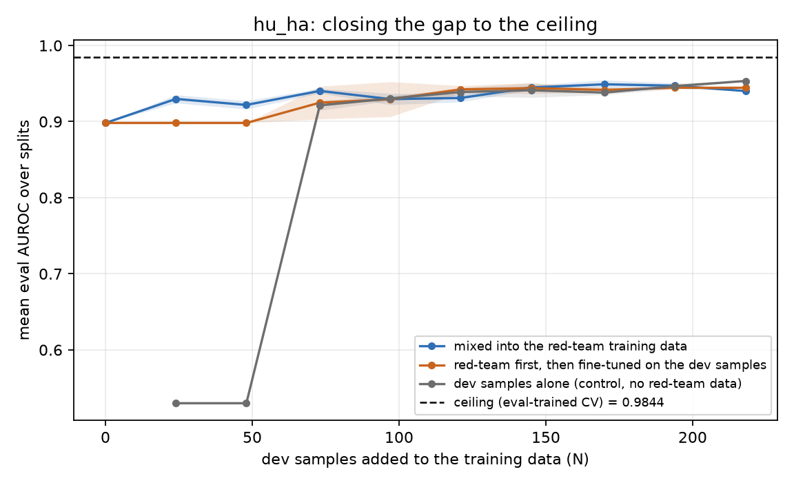

# Ceiling analysis — results

### hu_ha

* ceiling (eval-trained 5-fold CV, best rung `693+dev218`): **0.9844** mean eval AUROC
* red-team only (N=0): **0.8982** — gap +0.0862
* ceiling CV at 173 training rows/fold: 0.9439
* ceiling CV at 346 training rows/fold: 0.9605
* ceiling CV at 693 training rows/fold: 0.9777
* ceiling CV at 693+dev218 training rows/fold: 0.9844
* **the ladder is still climbing** (+0.0068 on the top step), so 0.9844 is a *lower bound* on the ceiling, not a plateau — the eval set simply has no more in-distribution rows to train on

| arm | best AUROC | at N | N to close 90% of gap | 95% | N within 0.01 of ceiling |
| --- | --- | --- | --- | --- | --- |
| mixed into the red-team training data | 0.9490 | 170 | None | None | None |
| red-team first, then fine-tuned on the dev samples | 0.9444 | 218 | None | None | None |
| dev samples alone (control, no red-team data) | 0.9534 | 218 | None | None | None |

> **Points that never take an optimizer step.** With the default `batch_size` 16 and `gradient_accumulation_steps` 4, a training set below 64 samples yields fewer batches per epoch than the accumulation period, so `optimizer.step()` is never called and the head is returned at its random initialisation. This is tuberlens' own loop, not an artifact of this analysis, and it applies to: `dev_only` at N=24 (24 train rows), `dev_only` at N=48 (48 train rows). Read those points as 'no training happened', not as 'the data did not help'. The `mixed` arm is unaffected — it always carries the red-team set.

For context, the probes those experiment runs actually produced (their own comparison CSVs, mean eval AUROC per retrain round):

| run | round | mean eval AUROC |
| --- | --- | --- |
| experiment17 gpt-oss-120b, ens10, dev-validated | iter4 | 0.8826 |
| experiment17 gpt-oss-120b, ens10, dev-validated | iter5 | 0.8751 |

